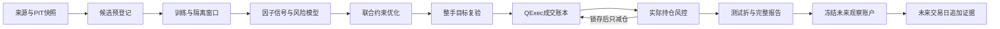

# 约束、PIT与风险执行

本轮把组合优化、风险模型与真实成交账本接通。使用本目录的固定提交清单安装，研究产物放在各源码仓库外。未完成的数据覆盖不会被合成成真实PIT证据。

## 从研究到观察



1. QDK捕获行情、公司行动与来源文档，发布不可变快照。主表证据与行情捕获分开记录；`bind-master`发布子快照，不覆盖父快照。
2. QLab校验配方，登记全部候选和方向。财务、行业、状态等历史字段必须声明所属域，并通过可得时间与覆盖检查。
3. QF计算因子；配置中性化时先中性化，再截面百分位排序，最后延迟。训练IC使用相同信号表示，不能拿未延迟IC决定延迟策略方向。
4. QPipeline按训练、隔离、测试窗口滚动；只在训练窗口选择候选。测试折收益来自QExec账本，保留失败、成本压力和延迟候选。
5. QPortfolio按当时NAV联合处理预算、单标的上限、行业上限、换手和因子边界。约束无交集或求解不收敛时拒绝，不能先满足一项再破坏另一项。
6. ASM把优化权重转为整手目标后再次检查组合、因子和跟踪误差；QExec负责订单、交易规则、费用、可用持仓和账本。
7. 实际持仓每天重新检查。超限会锁存风险状态，撤销挂单并释放预约；根据配方停止交易或持续尝试清仓。停牌、跌停等真实交易约束仍可能阻止成交。
8. QReport汇总测试折收益与风险执行证据。未来观察另行登记，从未来起点逐日追加，不能把历史回放重命名为真实前向结果。

## 风险模型配置

`risk_model`只与`allocation.mode: cost_aware`联合使用。支持期初已知的暴露矩阵X、因子收益、收缩后的因子协方差F、特异方差D以及`Σ=XFXᵀ+D`。风险收益使用原始价格及此前已公告的分红或份额权益；未来复权版本不进入风险收益估计。

`factor_bounds`限制绝对暴露；`active_factor_bounds`结合`benchmark_weights`转为优化约束。基准权重必须非负且合计为1。`max_tracking_error`在整手目标和实际持仓处检查，是执行门禁，尚未作为优化器内的二次约束。行业限制使用PIT行业标签构造指示矩阵。

`model_kind: statistical_proxy`必须用于仅有market常数因子的模型。`fundamental_style`需要真正的描述子映射与PIT历史，只有参数名称或合成暴露不构成真实风格数据。当前实现不是MSCI授权Barra，也未完成行业约束加权回归、描述子体系、波动率偏差校准、时变特异风险和ETF成分穿透。

## 风控行为

`risk.drawdown_action`与`risk.exposure_breach_action`可取`halt`或`liquidate`。默认`halt`停止新交易；`liquidate`通过原账本发出只减仓订单。两类风险同时或先后发生时，更强的清仓动作不会被停止动作降级。锁存后不会因次日价格回升自动重入。

配置成本上限时必须提供`estimated_cost_rate_per_turnover`，估计缺失不能视作零成本。风险库拒绝缺失持仓暴露、无穷收益、非正半定风险矩阵及缺失的必需漂移因子；迟到旧观测不能覆盖更新的观测。

只减仓并非无条件豁免：系统允许实际减少已有的敞口超限，但仍检查数据时点、NAV、流动性、交易规则与已配置的复杂风险限制。因此清仓请求可能被阻止，报告必须保留原因，不能把请求等同于成交。

## 运行与前向

从集成目录运行，先执行`run.py verify`。外层集成根目录参数放在command前；command后的`--root`属于子命令，例如：

```powershell
.venv-research/Scripts/python.exe quant-workspace/profiles/research-workbench/run.py dataset inspect --root data/etf
.venv-research/Scripts/python.exe quant-workspace/profiles/research-workbench/run.py run recipes/etf-risk.yaml --output studies/etf-risk
.venv-research/Scripts/python.exe quant-workspace/profiles/research-workbench/run.py paper promote studies/etf-risk/study.json --candidate base --output paper/etf-risk --account-id etf-risk-forward --start YYYY-MM-DD --end YYYY-MM-DD
```

未来起止日期必须在注册时仍属未来，且日历覆盖起点。冻结源代码、配方、账户和数据前缀后，再更新同一数据来源并提交新输入引用：

```powershell
.venv-research/Scripts/python.exe quant-workspace/profiles/research-workbench/run.py dataset update --root data/etf --end YYYY-MM-DD
.venv-research/Scripts/python.exe quant-workspace/profiles/research-workbench/run.py paper observe paper/etf-risk --recipe recipes/etf-risk-updated-inputs.yaml --as-of YYYY-MM-DD
```

观察使用从冻结起点连续回放的同一账本，并校验已有收益与历史输入前缀。供应商修订、主表到期、代码变化或缺失状态会阻断；不得为通过观察而覆盖历史或移动起点。真实前向样本只能随未来交易日积累。
